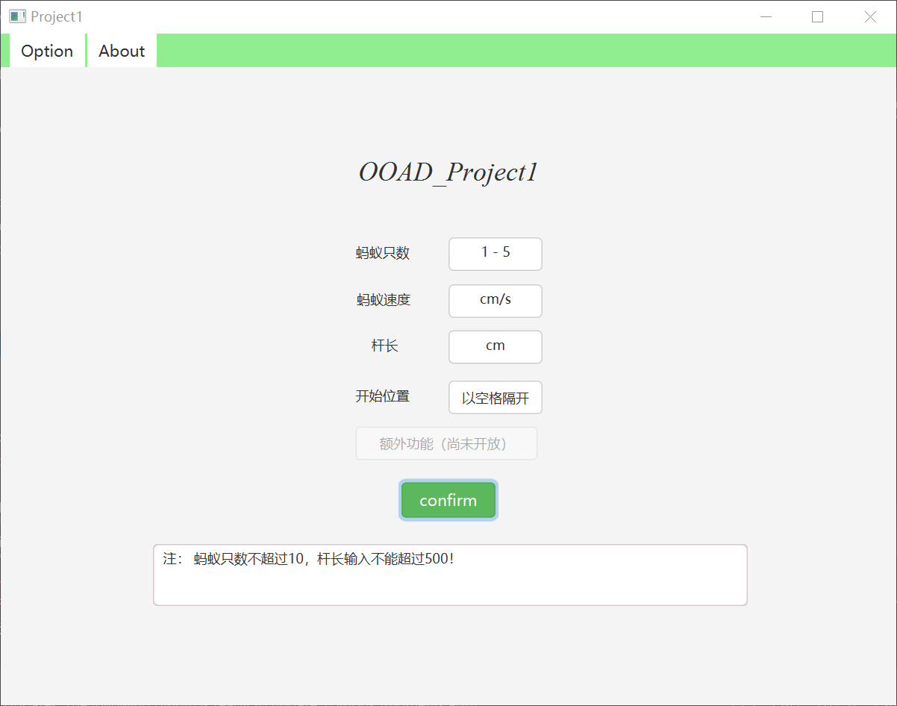
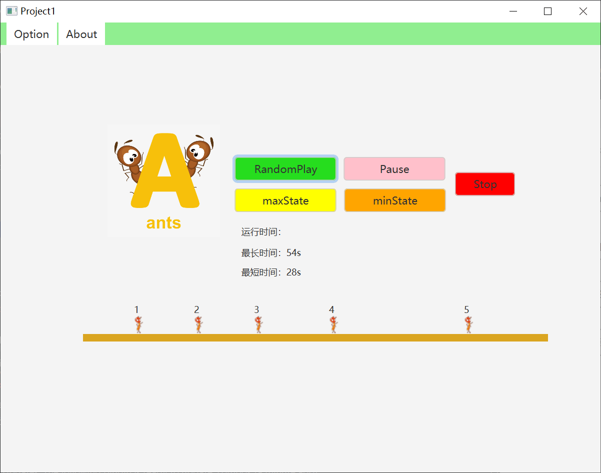

# OOAD_Projects

SE_OOAD_Class(2019-2020)

## 开发工具及准备
+ `IDEA` (2019 ultimate)& `SceneBuilder`(11.0.0)

+ javafx 11

+  [javafx学习](https://www.w3cschool.cn/java/javafx-line.html)

## 效果图(部分)

> 大致按照使用流程贴出

+ proA  : 蚂蚁爬竿

    
    
    

    

+ proB  : blackjack

    

    

    

    

+ proC

## 可能遇到的坑
+   准备阶段
    1. javafx11无法被[识别](http://www.imooc.com/wenda/detail/573228)
    
    2. kotlin模块报错[rebuild](https://stackoverflow.com/questions/53497454/intellij-idea-ultimate-2018-3-thinks-my-java-9-project-is-a-kotlin-project)
    
    3. IDEA衔接SceneBuilder[三之后的章节](https://blog.csdn.net/u011781521/article/details/86632482)

+   proA

+   proB
    1. maven配置javafx(配合JDK11.0.1)
    2. 多种WinningState的判断

+ proC

## 其他

+ 一切工具版本需要保持一致。

+ 运行时遇到问题一般在`准备阶段`能找到解决方案，如果有其他问题请issue给出。
    
    
