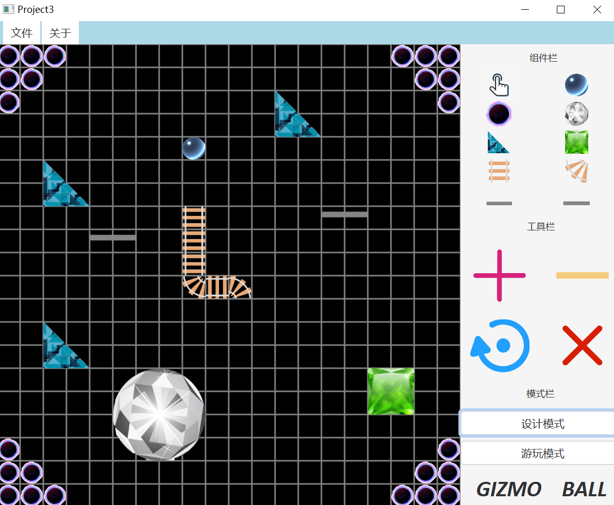

# OOAD_Projects

SE_OOAD_Class(2019-2020)

## group_num: 20

- [Onion](https://github.com/Onion12138)

- [LEO D PEN](https://github.com/LEODPEN)

- [TimGin](https://github.com/TimGin117)

## 开发工具及准备
+ `IDEA` (2019 ultimate)& `SceneBuilder`(11.0.0)

+ javafx 11

+  [~~javafx学习~~](https://www.w3cschool.cn/java/javafx-line.html)（看各种博客较佳）

## 效果图

+ proA  : [蚂蚁爬竿](./projects/project1.md)
    
    

+ proB  : [blackjack](./project2/project2.md)

    

+ proC  : [gizmo ball](./project3/project3.md)

    

## 可能遇到的坑
+   准备阶段
    1. javafx11无法被[识别](http://www.imooc.com/wenda/detail/573228)
    
    2. kotlin模块报错[rebuild](https://stackoverflow.com/questions/53497454/intellij-idea-ultimate-2018-3-thinks-my-java-9-project-is-a-kotlin-project)
    
    3. IDEA衔接SceneBuilder[三之后的章节](https://blog.csdn.net/u011781521/article/details/86632482)

+   proA
    1. 编号与蚂蚁同步

+   proB
    1. maven配置javafx(配合JDK11.0.1)
    2. 多种WinningState的判断

+   proC
    1. 重力何时消除与恢复
    2. view与model联系方式
    3. 弹性系数合理设置
    4. 一些奇妙的bugs

## 其他

+ 一切工具版本需要保持一致。

+ 运行时遇到问题一般在`准备阶段`能找到解决方案，如果有其他问题均在issues给出。

+ proC 仍有部分无法预测和控制的:bug:，选择躺平(~~又不是不能用~~)。
    
    
